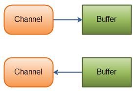

# NIO Channel & Buffer

## Non Blocking IO (NIO)

**thread** can ask a **channel** to **read data** into a **buffer**

이때, buffer에 쓰여지기 전 까지 thread는 ***다른 일을 할 수 있다.***

- standard IO
    
    **byte** **stream**  or  **character** **stream**
    
- NIO
    
    **channel**  and  **buffers**
    
    - read from a channel into a buffer
    - written from a buffer to a channel
    
    
    

### Blocking / NonBlocking

- IO에서 read()/write()로 stream을 읽을 때 Blocking이 발생.
stream을 닫던지, 입/출력이 완료되기 전에는 블로킹 상태.
- NIO에서는 준비가 다 된 채널에 대해서 쓰레드가 관여하기 때문에 넌블럭킹.
인터럽트를 통해서 빠져나올 수도 있음.
selector가 완료된 channel을 알려줌.

### Selectors

하나의 Thread가 여러개의 channel을 왔다갔다 하기 위한 방법.

→ selector는 여러 channel을 모니터링 하면서 event를 감지함.

## Channel

java.nio.channels

```java
// 닫혀있으면 Exception.
public interface Channel extends Closeable {
    public boolean isOpen();

    public void close() throws IOException;
}
```

- FileChannel
- DatagramChannel
- SocketChannel
- ServerSocketChannel

## Buffer

java.nio.buffer

primitive type별로 container가 있다.

< 시나리오 참조 > 

[https://palpit.tistory.com/641](https://palpit.tistory.com/641)

**capacity:** 

buffer's element 수
음수가 안되고 변경되지 않음.

**limit :** 

read/written되지 않는 첫 번째 element의 index  ⇒ 첫 번째 빈공간인 것 같음.
음수가 안되고 capacity 보다 크지 않음.

**position :** 

다음으로 read/written 될 element의 index
음수가 안되고 limit보다 크지 않음.


**ex) 기본 7바이트로 Buffer를 만들면.**

```java
ByteBuffer buffer = ByteBuffer.allocateDirect(7);
```


**< 5바이트 저장 >**

```java
buffer.put((byte) 10);
buffer.put((byte) 11);
buffer.put((byte) 12);
buffer.put((byte) 13);
buffer.put((byte) 14);
```


### method

- flip()
    
    Buffer를 읽기 위해 필요 (get)
    
    limit → 현재 postion 으로
    postion → 0 으로
    

**< flip 실행 >**

```java
buffer.flip();
```


**< 읽기 >**

```java
buffer.get(new byte[3]);
```


- mark()
    
    현재 position을 기억.
    
    2바이트를 읽더라도 다시 돌아올 수 있음.
    

**< 현재 position 마크 하기 >**

```java
buffer.mark();
```


**< mark된 채로 2바이트 더 읽기 >**


- reset()
    
    mark가 있는 상태에서, mark()로 position 변경.
    

< reset으로 mark() 로 돌아가기 > 

```java
buffer.reset();
```


- rewind()
    
    limit → 그대로
    position → 0 으로
    

< rewind 실행 >

```java
buffer.rewind();
```


- clear()
    
    3가지 position, limit, capacity 모두 초기화.
    limit → capacity
    position → 0
    

```java
buffer.clear();
```


- compact()
    
    position → 현재 position을 0 ~> 넣은 만큼 다음.
    limit → capacity로 초기화.
    
- slice()
    
    잘라내기
    
- duplicate()
    
    붙여넣기
    

### get / put이 구현 되있음.

- BufferOverflowException
    
    limit 보다 크게  put을 할 경우.
    
- BufferUnderflowException
    
    limit 보다 크게 get을 할 경우.
    
- IndexOutOfBoundsException
    
    절댓값 지정했는데 limit 초과일 경우.
    

### 넌다이렉트 버퍼 / 다이렉트 버퍼

- buffer.allocate
    
    JVM  힙 메모리 사용.
    용량이 작음.
    성능이 안좋음.
    생성 속도 빠름.
    
- buffer.allocateDirect
    
    운영체제의 메모리 사용.
    용량이 큼.
    성능이 좋음.
    생성 속도 느림.
    ByteBuffer에만 있음.
    

- ByteBuffer
- CharBuffer
- DoubleBuffer
- FloatBuffer
- IntBuffer
- LongBuffer
- ShortBuffer
