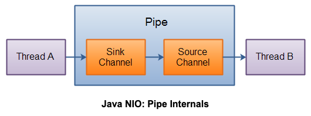

# NIO Pipe

읽는 쓰레드와 쓰는 쓰레드를 구분함과 동시에,
읽고쓰는 순서를 정확하게 하기 위해서 만들어짐. (1.4)

[Pipe (Java Platform SE 7 )](https://docs.oracle.com/javase/7/docs/api/java/nio/channels/Pipe.html)

두 쓰레드간 단방향(one-way)연결.

Thread A —> Thread B
사이에서 Pipe ( Sink channel & Source Channel )로 연결 가능.



### 1. Pipe

```java
Pipe pipe = Pipe.open();
```

### 2. Buffer Read와 SinkChannel Write

```java
Pipe.SinkChannel sinkChannel = pipe.sink();

String data = "Hello World!";
ByteBuffer bufferRead = ByteBuffer.allocate(32);
bufferRead.clear();
bufferRead.put(data.getBytes());
bufferRead.flip();

while(bufferRead.hasRemaining()){
    sinkChannel.write(bufferRead);
}
```

### 3. SourceChannel Read와 Buffer Write

```java
Pipe.SourceChannel sourceChannel = pipe.source();

ByteBuffer bufferWrite = ByteBuffer.allocate(32);
int bytesRead = sourceChannel.read(bufferWrite);
```

### 4. Print

```java
System.out.println(bytesRead);
```


### 이걸 어디에 쓸까?

읽는 쓰레드와 쓰는 쓰레드를 구분함과 동시에,
읽고쓰는 순서를 정확하게 하기 위해서 만들어짐. (1.4)
