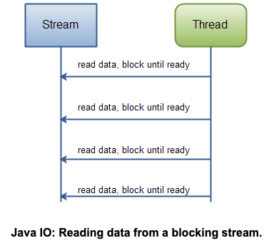
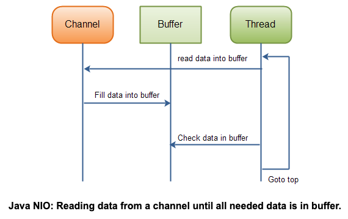

# NIO

### NIO Channel & Buffer

[NIO Channel & Buffer](NIO-Channel-&-Buffer/README.md)

### NIO Scatter & Gather

[NIO Scatter & Gather](NIO-Scatter-&-Gather/README.md)

### NIO Pipe

[NIO Pipe](NIO-Pipe/README.md)

## IO vs NIO

### IO

- Stream
- Data를 앞/뒤로 이동하려면 Buffer에 캐시해야함.
- read() / write() 시 Blocking
    
    → 다른 작업을 할 수 없음.
    
- 장점:
    1. 많은 데이터를 다루는 경우 적합함.

### NIO

- Buffer
- Buffer안에서 데이터 이동을 할 수 있음.
- read() / write() 시 NonBlocking
    
    → 다른 작업을 할 수 있음.
    ⇒ 다른 Channel로 이동해서 input/output을 할 수 있음.
    
- Selector가 필요함.
- 장점 :
    1. single or few 쓰레드로 multiple 채널을 관리할 수 있음.
    2. socket, p2p 여러 연결을 동시에 처리할 수 있음.
    단, 데이터가 소량이여야함.

